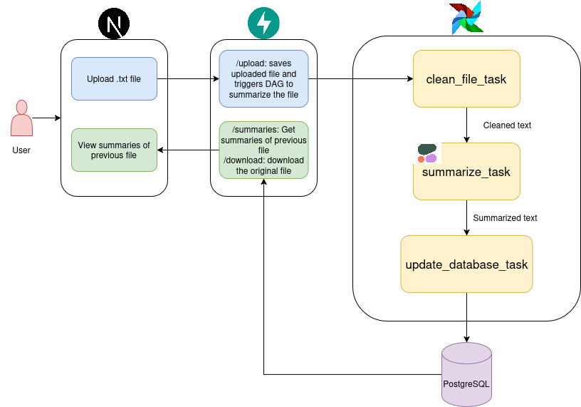

# Content Summarizer with Airflow, FastAPI & Next.js

Users upload documents through NextJS UI, the fastAPI API triggers Airflow DAG to process the contents of the file, and then the Airflow DAG calls the Cohere LLM to generate a summary of the content and save it in PostgreSQL DB. The user can view the summary of the document in the UI.

# Run the FastAPI Backend

```bash
cd fastapi
uvicorn app:app --reload
```
It has 3 APIs:

- `/upload/` - Uploads a file and triggers Airflow DAG
- `/summaries/` - Fetches summaries from the DB
- `/download/{filename}` - Downloads a file from the upload directory

# Run the NextJS Frontend

```bash
cd doc_summarizer
npm run dev
```
The frontend contains 2 UI pages:

- `/` - Uploads a file and triggers Airflow DAG
- `/summaries` - Fetches summaries from the DB

# Run the Airflow DAG

Create custom Docker image for the Airflow:

```bash
cd airflow
docker build . --tag extending_airflow:latest
```  

The **requirements.txt** file contains the dependencies(such as Cohere) required by the Airflow DAG. 

# Initializing Environment

Before starting Airflow for the first time, you need to prepare your environment, i.e. create the necessary files, directories and initialize the database.

Create the necessary directories:

```bash
cd airflow
mkdir -p ./dags ./logs ./plugins ./config
```
Inside the **dags** folder, create the **.env** file to keep the Cohere API key.

Initialize the database:

```bash
cd airflow
docker compose up airflow-init
```

Start Airflow:

```bash
cd airflow
docker compose up -d
```

# System Diagram


